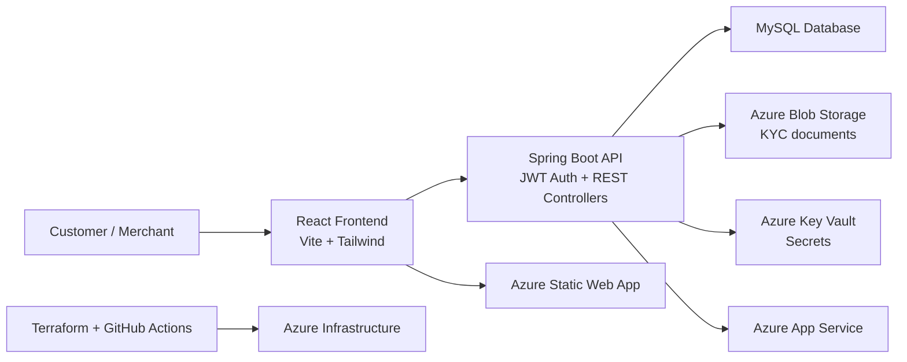

# SwiftPay

[](https://github.com/adityamaheshwari-25/SwiftPay/actions/workflows/dev-backend.yml)
[](https://github.com/adityamaheshwari-25/SwiftPay/actions/workflows/dev-frontend.yml)
[](https://github.com/adityamaheshwari-25/SwiftPay/actions/workflows/prod-backend.yml)
[](https://github.com/adityamaheshwari-25/SwiftPay/actions/workflows/prod-frontend.yml)
[](https://github.com/adityamaheshwari-25/SwiftPay/actions/workflows/prod-infrastructure.yml)

SwiftPay is a full-stack digital wallet and payments platform inspired by modern fintech products like Paytm. It combines a Java Spring Boot backend, a React + Vite frontend, Azure cloud infrastructure, and automated CI/CD pipelines to support secure wallet operations, KYC workflows, split payments, and merchant onboarding in a production-ready project structure.

This repository is organized as a monorepo-style deployment project with separate application directories for the backend and frontend, Terraform infrastructure under `infra/`, workflow definitions under `.github/workflows/`, and operational notes under `notes/`.

## Why SwiftPay?

The project demonstrates a realistic digital payments system with core capabilities such as:

- User and merchant registration/authentication
- Wallet funding and withdrawal
- Wallet-to-wallet transfers
- Transaction history and spending insights
- KYC document submission and review flow
- Split bills and group payments
- Merchant dashboard and reporting
- Secure Azure-backed deployment patterns

## Architecture overview



## Core features

### Authentication and user lifecycle
- Registration for consumer users and merchants
- JWT-based API authentication
- Role-aware authorization and protected endpoints
- Secure startup/bootstrap for super-admin configuration

### Wallet operations
- Add money to wallet from a linked bank account
- Withdraw funds to a bank account
- P2P wallet transfers using mobile number lookup
- Wallet balance lookup
- Spending insight reports per month

### Transactions and auditability
- Pagination-based transaction history
- Transaction status tracking
- Audit logging and idempotent processing patterns
- Support for financial operations with retry-safe keys

### KYC and compliance
- KYC document upload support
- Azure Blob Storage integration for secure document handling
- Validation for file type and size
- KYC approval/rejection workflows for admin operations

### Split payments
- Create split payment requests
- Track created and involved splits
- Pay share contribution with validation rules
- Support for custom share and participant logic

### Merchant and admin capabilities
- Merchant management and dashboards
- KYC admin review endpoints
- Settlement and merchant reporting
- Collection and transaction analytics

## Technology stack

### Frontend
- React 19
- Vite
- Tailwind CSS
- React Router
- TanStack Query
- Radix UI primitives
- Framer Motion
- Axios
- Sonner notifications

### Backend
- Java 17
- Spring Boot 4
- Spring Web / MVC
- Spring Security
- Spring Data JPA
- Spring Validation
- Flyway
- JWT (jjwt)
- ModelMapper
- Caffeine cache
- Apache POI

### Data and cloud
- MySQL
- Azure Blob Storage
- Azure Identity
- Azure App Service
- Azure Static Web Apps
- Terraform
- GitHub Actions

## Repository structure

```text
SwiftPay/
├── .github/
│   └── workflows/
│       ├── dev-backend.yml
│       ├── dev-frontend.yml
│       ├── prod-backend.yml
│       ├── prod-frontend.yml
│       └── prod-infrastructure.yml
├── PaytmCloneBackend/
│   ├── src/
│   ├── .env.example
│   ├── .mvn/
│   ├── mvnw
│   ├── mvnw.cmd
│   ├── pom.xml
│   └── README.md (if present in subproject)
├── PaytmCloneFrontend/
│   ├── src/
│   ├── public/
│   ├── .env.example
│   ├── package.json
│   └── vite.config.*
├── infra/
│   └── Terraform infrastructure assets
├── notes/
│   └── workflow diagrams and operational notes
├── scripts/
│   └── Helper scripts and automation
├── README.md
└── .gitignore
```

## Getting started

### Prerequisites

Before running the application, make sure you have the following installed:

- Java 17+
- Maven or the included Maven wrapper
- Node.js 18+
- npm
- MySQL (for local development)
- Azure CLI (optional, for cloud deployment)
- Git

## Backend setup

1. Navigate to the backend directory:

```bash
cd PaytmCloneBackend
```

2. Copy the example environment file and configure the values:

```bash
cp .env.example .env
```

3. Update the environment variables in your shell or `.env` file. Key values include:

- `DB_URL`
- `DB_USERNAME`
- `DB_PASSWORD`
- `JPA_DDL_AUTO`
- `CORS_ALLOWED_ORIGINS`
- `AZURE_STORAGE_BLOB_ENDPOINT`
- `AZURE_STORAGE_BLOB_CONTAINER`
- `JWT_SECRET`
- `JWT_EXPIRATION`
- `SUPERADMIN_EMAIL`
- `SUPERADMIN_PASSWORD`

4. Run the application:

```bash
./mvnw spring-boot:run
```

The application uses `application.properties` for runtime configuration and resolves secrets from environment variables or cloud configuration.

5. Optional: run the test suite and build:

```bash
./mvnw clean verify
```

## Frontend setup

1. Navigate to the frontend folder:

```bash
cd PaytmCloneFrontend
```

2. Install dependencies:

```bash
npm install
```

3. Configure environment variables:

```bash
cp .env.example .env
```

4. Update the API base URL and app name if needed:

```env
VITE_API_BASE_URL=http://localhost:8080/api/v1
VITE_APP_NAME=PayWallet
```

5. Start the app:

```bash
npm run dev
```

The frontend defaults to the Vite development server and can be previewed at:

```text
http://localhost:5173
```

## Environment variables

### Backend example values

```env
SPRING_PROFILES_ACTIVE=prod
DB_URL=jdbc:mysql://your-server.mysql.database.azure.com:3306/swiftpay?sslMode=REQUIRED&serverTimezone=UTC
DB_USERNAME=replace-me
DB_PASSWORD=replace-me
JPA_DDL_AUTO=update
CORS_ALLOWED_ORIGINS=https://your-frontend.example.com
AZURE_STORAGE_BLOB_ENDPOINT=https://your-storage-account.blob.core.windows.net
AZURE_STORAGE_BLOB_CONTAINER=kyc-documents
JWT_SECRET=replace-with-at-least-32-random-characters
JWT_EXPIRATION=10h
SUPERADMIN_EMAIL=superadmin@example.com
SUPERADMIN_PASSWORD=replace-with-a-strong-secret
```

### Frontend example values

```env
VITE_API_BASE_URL=https://your-api-app.azurewebsites.net/api/v1
VITE_APP_NAME=PayWallet
```

## API surface

The backend exposes REST endpoints under `/api/v1`.

### Auth
- `POST /api/v1/users/register`
- `POST /api/v1/merchants/register`
- `POST /api/v1/auth/login`

### Wallet
- `POST /api/v1/wallet/add-money`
- `POST /api/v1/wallet/withdraw`
- `GET /api/v1/wallet/me`
- `POST /api/v1/wallet/transfer`
- `GET /api/v1/wallet/spending-insight`

### Transactions
- `GET /api/v1/transactions/my`

### KYC
- `POST /api/v1/kyc/upload`

### Split payments
- `POST /api/v1/splits`
- `GET /api/v1/splits/{splitId}`
- `POST /api/v1/splits/{splitId}/pay`
- `GET /api/v1/splits/me/created`
- `GET /api/v1/splits/me/involved`

## Security and reliability features

- JWT authentication for protected APIs
- Exact origin validation for CORS configuration
- Input validation on DTOs and requests
- Idempotency headers for money movement operations
- KYC approval gating before sensitive operations
- MySQL-backed persistence with Flyway migration support
- Azure identity integration with managed identities for cloud resources
- Health endpoint exposure for deployment checks

## Deployment model

This repository includes GitHub Actions for both development and production environments.

- Dev backend workflow: deploys backend changes to the development environment
- Dev frontend workflow: deploys frontend changes to the dev environment
- Prod backend workflow: validates and deploys production backend releases
- Prod frontend workflow: validates and deploys production frontend artifacts
- Prod infrastructure workflow: Terraform validation, plan, and apply with approval gating

The operational pattern is:

1. Open a pull request for application or infrastructure changes
2. Run validation checks
3. Merge to main
4. Trigger the relevant dev deployment or production release process
5. Require approval and health verification before production rollout

## Infrastructure

The `infra/` folder contains Terraform configuration for Azure resources and environment-specific modules. The project structure is designed for clear separation between bootstrap, shared modules, and environment-specific deployment roots. This supports modular deployments for dev and prod environments while keeping state and resource isolation explicit.

## Notes and workflow docs

The `notes/` directory includes flowchart documentation that explains the CI/CD and release strategy for backend, frontend, and infrastructure workflows. These notes are useful when understanding how deployment gates and approvals are enforced.

## Testing and quality

The backend includes JaCoCo configuration and test dependencies using Spring Boot test support. The frontend has ESLint rules and a production build pipeline to validate code quality before deployment.

## Contribution guidelines

1. Create a feature branch from `main`
2. Keep backend and frontend changes isolated unless they are intentionally linked
3. Update or document environment variables when you change configuration
4. Validate both build and deployment workflows before merging
5. Keep production security settings explicit and avoid wildcard CORS rules or insecure secrets

## Future improvements

Possible enhancements for the project include:

- Bank account verification and real transaction settlement integration
- Admin approval panels with richer audit dashboards
- Payment notifications and event-driven webhook flows
- Multi-environment secrets automation with Key Vault integration
- More advanced analytics and reporting
- Performance tuning and distributed tracing

## License

This project does not currently declare a license in the repository metadata, so use the repository settings or project owner to confirm the intended licensing terms before production use or redistribution.

## Project status

SwiftPay is structured as a practical, production-minded fintech application prototype with backend logic, frontend UI, cloud deployment automation, and Azure-first infrastructure patterns. It is suitable for learning, demo purposes, and extension into a full commercial payment product.

## Acknowledgements

This project incorporates patterns and experiences common to modern fintech application design, including secure wallet architecture, KYC workflows, robust deployment gates, and cloud-native infrastructure management.

---

For more detailed operational guidance, review the workflow notes in `notes/` and the Azure deployment configuration under `.github/workflows/` and `infra/`.
