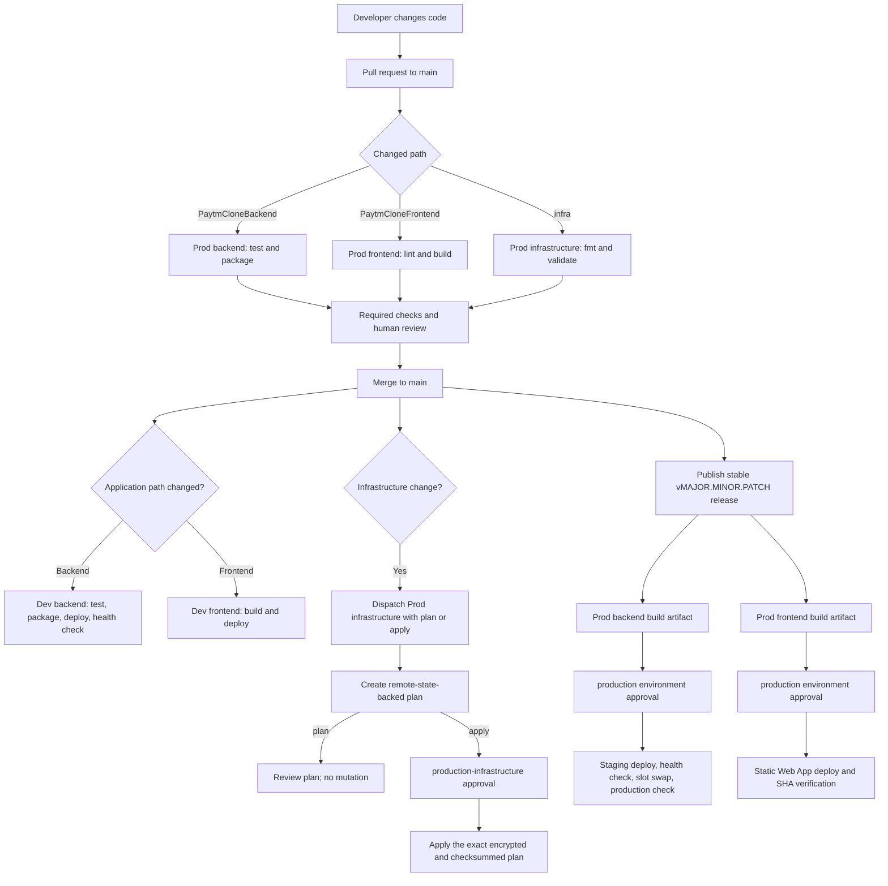
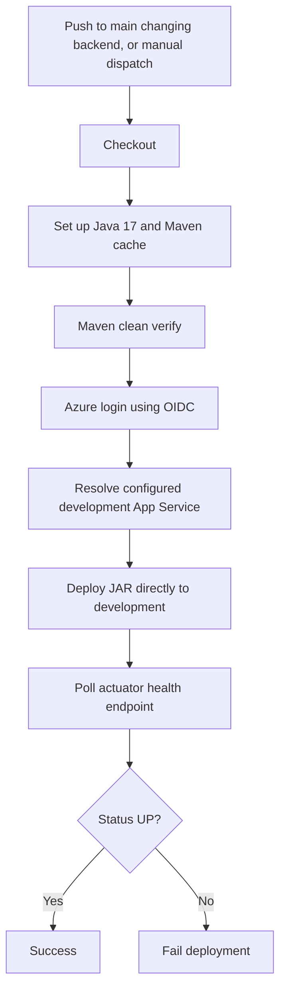
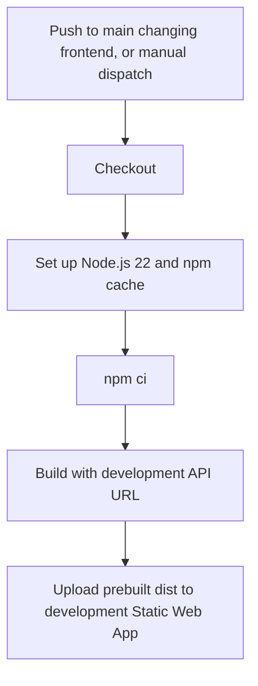
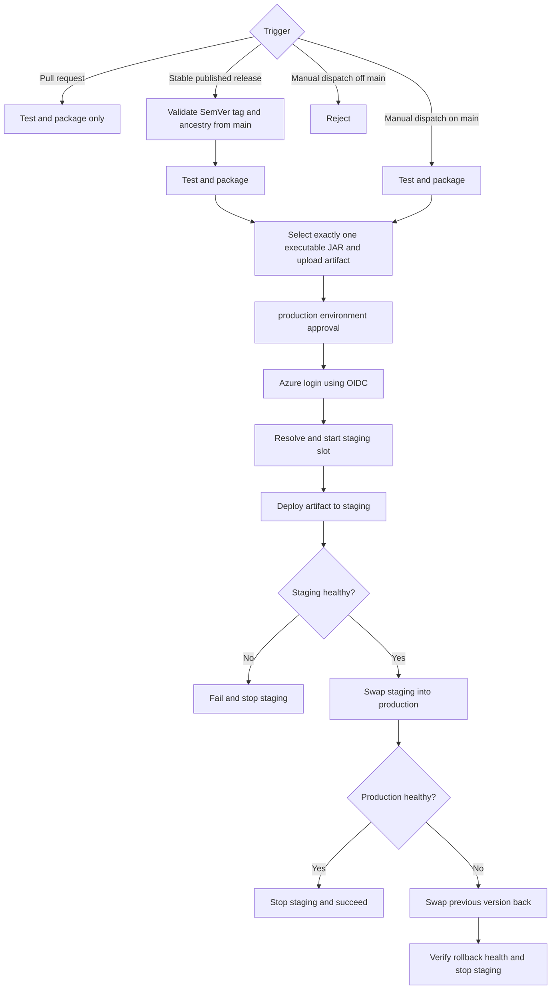
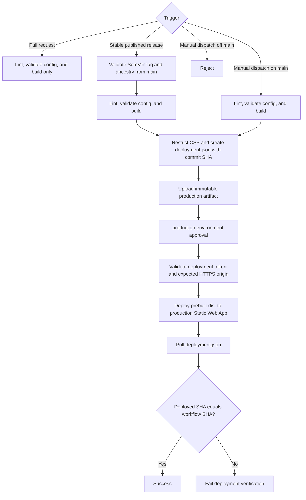
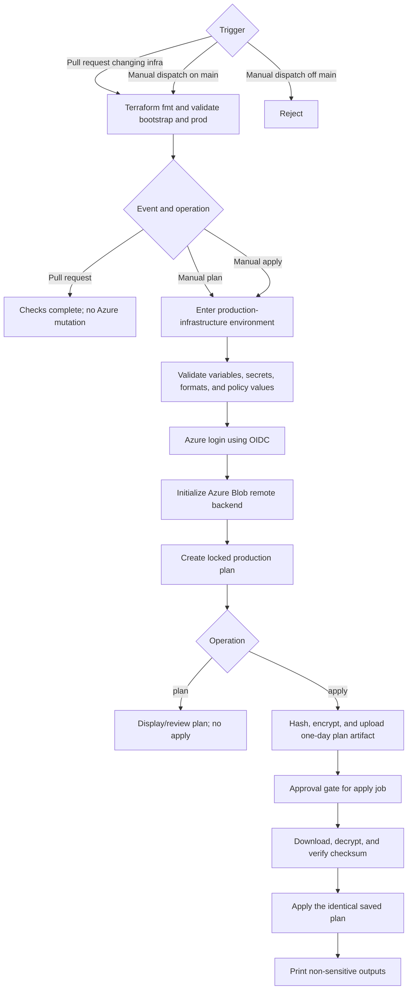

# SwiftPay workflow flowcharts

These diagrams describe the workflows currently present in `.github/workflows`.
A pull request run validates code; it does not deploy production. Production
application deployment is release- or manually initiated, while production
infrastructure apply is manually initiated and approval-gated.

## Overall delivery flow



There is no `workflow_call`, `workflow_run`, `repository_dispatch`, or `gh workflow`
step connecting these files. The production application workflows therefore do
not call the infrastructure workflow, and the infrastructure workflow does not
call the application workflows. Their dependency is operational: provision or
update infrastructure first, configure the GitHub environment values produced by
Terraform, and then publish a release.

## Dev backend



## Dev frontend



## Production backend



## Production frontend



## Production infrastructure



## Recommended layout when development infrastructure is added

```text
infra/
|-- bootstrap/
|   |-- main.tf
|   |-- variables.tf
|   |-- outputs.tf
|   |-- providers.tf
|   `-- versions.tf
|-- modules/
|   |-- network/
|   |-- data-services/
|   |-- application/
|   `-- monitoring/
`-- environments/
    |-- dev/
    |   |-- backend.tf
    |   |-- main.tf
    |   |-- variables.tf
    |   |-- outputs.tf
    |   `-- terraform.tfvars.example
    `-- prod/
        |-- backend.tf
        |-- main.tf
        |-- variables.tf
        |-- outputs.tf
        `-- terraform.tfvars.example

.github/workflows/
|-- dev-infrastructure.yml
|-- dev-backend.yml
|-- dev-frontend.yml
|-- prod-infrastructure.yml
|-- prod-backend.yml
`-- prod-frontend.yml
```

Use a separate state key per root module and environment, for example
`swiftpay/bootstrap.tfstate`, `swiftpay/dev.tfstate`, and
`swiftpay/prod.tfstate`. Prefer reusable modules for shared resource patterns,
but keep separate environment root modules, credentials, GitHub environments,
resource groups, state keys, approvals, sizing, and safety policy. Do not make
`dev` and `prod` Terraform workspaces over one loosely parameterized root unless
the team deliberately accepts the weaker isolation and larger blast radius.
